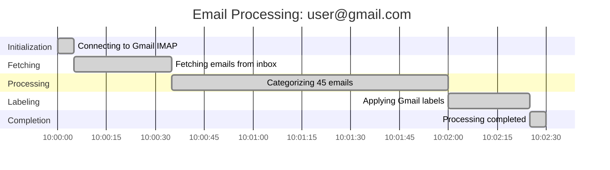

# BDD Specification: Gantt Chart Generator Core

## Feature Overview

Convert state transition data into valid Mermaid Gantt chart text for visualization of email processing timelines. This is Part 2 of 3 for the Gantt Chart Text Generation feature.

## Gherkin Feature File

**Location**: `./tests/bdd/gantt_chart_generator_core.feature`

## Scenario Summary

| Category | Count | Description |
|----------|-------|-------------|
| Basic Generation | 1 | Complete run with all transitions |
| Date/Time Formatting | 1 | dateFormat, axisFormat, timestamp formatting |
| Section Groupings | 1 | State-to-section mapping |
| Syntax Validation | 1 | Valid Mermaid syntax structure |
| **Total** | **4** | Core functionality coverage |

## Key Scenarios

### 1. Generate Gantt chart for a completed processing run

Validates that a completed run with state transitions produces valid Mermaid Gantt syntax with:
- "gantt" header
- Title containing email address
- Sections for each processing phase
- All tasks marked as "done"

### 2. Generate Gantt chart with proper date format

Ensures proper date/time formatting:
- `dateFormat YYYY-MM-DD HH:mm:ss`
- `axisFormat %H:%M:%S`
- Timestamps formatted correctly in task lines

### 3. Generate Gantt chart with section groupings

Verifies state-to-section mapping:
- CONNECTING → "Initialization" section
- FETCHING → "Fetching" section
- PROCESSING/CATEGORIZING → "Processing" section
- LABELING → "Labeling" section
- COMPLETED → "Completion" section

### 4. Gantt chart text is valid Mermaid syntax

Validates the output structure:
- Starts with "gantt"
- Contains valid "title" directive
- Contains valid "dateFormat" directive
- Contains valid "axisFormat" directive
- Task lines follow Mermaid syntax

## Example Mermaid Output

## Implementation Components

1. **IGanttChartGenerator Interface** (`/root/repo/services/interfaces/gantt_chart_generator_interface.py`)
   - `generate(transitions, title, include_zero_duration) -> str`
   - `validate_syntax(gantt_text) -> bool`

2. **GanttChartGenerator Implementation** (`/root/repo/services/gantt_chart_generator.py`)
   - State-to-section mapping
   - Duration formatting (seconds → Mermaid duration syntax)
   - Task ID generation
   - Task status markers (done, active, crit)

## Dependencies

- **Input**: `StateTransition` dataclass from `services/state_transition.py`
- **Output**: Mermaid Gantt chart text string

## Acceptance Criteria

1. ✅ Generator converts StateTransition list to valid Mermaid syntax
2. ✅ Title includes email address identifier
3. ✅ States are grouped into logical sections
4. ✅ Date/time format follows Mermaid specification
5. ✅ All tasks marked as "done" for completed runs
6. ✅ Output is directly usable by mermaid.js in UI
