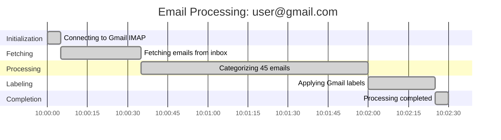

# BDD Specification: Gantt Chart Text Generation

## Feature Overview

Generate Mermaid Gantt chart text for email categorization runs. The system has a background process that categorizes emails from Gmail accounts. This feature generates Gantt chart text (using Mermaid syntax) for each run per account, included in the historical audit response for the UI to render independently.

## Gherkin Feature File

**Location**: `./tests/bdd/gantt_chart_generation.feature`

## Scenario Summary

| Category | Count | Description |
|----------|-------|-------------|
| Happy Paths | 4 | Complete runs, date formats, sections, multi-run |
| State Transition Tracking | 4 | Recording, duration calculation, archiving, persistence |
| API Response Enhancement | 4 | Include in response, per-account, empty history, backward compatibility |
| Error Handling | 2 | Failed during processing, connection failure |
| Zero/Minimal Duration | 3 | Zero duration, very short, very long runs |
| Missing/Incomplete Data | 3 | Minimal transitions, missing end time, legacy runs |
| Multiple Accounts | 2 | Varying states, account isolation |
| Mermaid Syntax Validation | 3 | Valid syntax, special characters, long descriptions |
| **Total** | **25** | Comprehensive coverage |

## Key Scenarios

### 1. Gantt Chart Generation - Happy Paths

- **Generate Gantt chart for a completed processing run**: Validates that a completed run with all state transitions produces valid Mermaid Gantt syntax with proper title, sections, and "done" task markers.

- **Generate Gantt chart with proper date format**: Ensures dateFormat is `YYYY-MM-DD HH:mm:ss` and axisFormat is `%H:%M:%S` for proper timeline rendering.

- **Generate Gantt chart with section groupings**: Verifies that phases are grouped into logical sections: Initialization, Fetching, Processing, Labeling, Completion.

- **Generate Gantt chart for multi-run history**: Confirms that multiple runs can be displayed in a combined chart with separate sections per run.

### 2. State Transition Tracking

- **Record state transitions during email processing**: Validates that state changes are captured with timestamps during processing.

- **Calculate duration between state transitions**: Ensures duration is correctly calculated as the time between consecutive transitions.

- **Clear state transitions when run completes**: Confirms transitions are archived and cleared for the next run.

- **State transitions persist in archived run data**: Validates the archived run structure includes `state_transitions` array.

### 3. API Response Enhancement

- **Include gantt_chart_text in processing history response**: The `/api/processing/history` endpoint returns `gantt_chart_text` for each run.

- **Return gantt chart for each run per account**: Each historical run has its own independent Gantt chart text.

- **Handle empty history with no completed runs**: Empty history returns empty array without errors.

- **Maintain backward compatibility with existing API consumers**: All existing fields remain present; new fields are additive.

### 4. Edge Cases

- **Error handling**: Failed runs show partial Gantt charts with "crit" markers and error indication in title.

- **Zero/minimal duration**: Handles edge cases of zero-duration phases and very short/long runs.

- **Missing data**: Gracefully handles legacy runs without transition data and in-progress runs.

- **Multiple accounts**: Ensures account isolation and handles varying completion states.

### 5. Mermaid Syntax Validation

- **Valid syntax structure**: Output starts with `gantt`, contains required directives.

- **Special character handling**: Email addresses with special characters are safely escaped.

- **Long description handling**: Step descriptions exceeding 100 characters are truncated appropriately.

## Example Mermaid Output



## API Response Schema

```json
{
  "recent_runs": [
    {
      "email_address": "user@gmail.com",
      "start_time": "2025-01-01T10:00:00",
      "end_time": "2025-01-01T10:02:30",
      "duration_seconds": 150.0,
      "final_state": "COMPLETED",
      "final_step": "Processing completed",
      "emails_reviewed": 45,
      "emails_tagged": 40,
      "emails_deleted": 5,
      "state_transitions": [
        {
          "state": "CONNECTING",
          "step_description": "Connecting to Gmail IMAP",
          "timestamp": "2025-01-01T10:00:00",
          "duration_seconds": 5.0
        }
      ],
      "gantt_chart_text": "gantt\n    title Email Processing: user@gmail.com\n    ..."
    }
  ]
}
```

## Implementation Components

1. **GanttChartGenerator Service** (`/root/repo/services/gantt_chart_generator.py`)
   - `generate_gantt_text(run_data: ProcessingRunGanttData) -> str`
   - `generate_combined_gantt_text(runs: List[ProcessingRunGanttData]) -> str`

2. **State Transition Tracking** (enhancement to `ProcessingStatusManager`)
   - `record_state_transition(state: str, step: str, timestamp: datetime)`
   - `get_state_transitions() -> List[StateTransition]`
   - `archive_transitions_to_run()`

3. **API Enhancement** (`/root/repo/api_service.py`)
   - Include `gantt_chart_text` in `/api/processing/history` response
   - Include `state_transitions` array in each run

## Testing Strategy

- **Unit Tests**: Test `GanttChartGenerator` with various input scenarios
- **Integration Tests**: Test API endpoint returns correct Gantt text
- **BDD Tests**: Execute Gherkin scenarios using pytest-bdd

## Dependencies

- No external dependencies required
- Uses existing `ProcessingStatusManager` and `ProcessingRun` model
- Follows existing patterns from `chart_generator.py`

## Acceptance Criteria

1. ✅ Gantt chart text is generated for each completed processing run
2. ✅ Gantt chart text is valid Mermaid syntax
3. ✅ Gantt chart is included in historical audit API response
4. ✅ Each account's runs have independent Gantt charts
5. ✅ State transitions are tracked with timestamps
6. ✅ Error states are properly indicated in charts
7. ✅ Backward compatibility maintained with existing API
