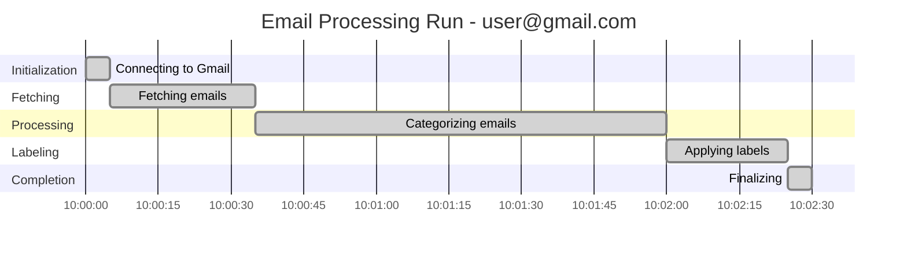
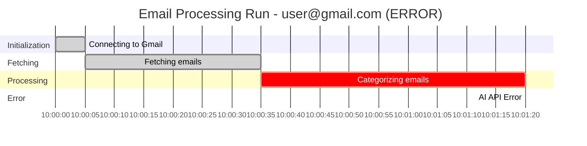

# DRAFT: Mermaid Gantt Chart Text Generation for Email Categorization Runs

## Overview

Generate Mermaid Gantt chart text for each email categorization run, providing a visual timeline representation of the processing phases. The Gantt chart text will be included in the historical audit API response, allowing the UI to render the chart independently using mermaid.js.

## Objectives

1. Create a dedicated service to generate valid Mermaid Gantt syntax from processing run data
2. Track state transitions with timestamps during email processing
3. Enhance the historical audit API response to include `gantt_chart_text` field
4. Maintain backward compatibility with existing API consumers

## Technical Approach

### Architecture Pattern

Following the existing service pattern in the codebase (similar to `chart_generator.py`), implement a pure text generator service that:

- Takes structured run data as input
- Returns valid Mermaid Gantt syntax as a string
- Has no external dependencies (pure Python string manipulation)
- Is stateless and easily testable

### Data Flow Diagram

```
+-------------------+     +------------------------+     +----------------------+
| ProcessingRun DB  | --> | GanttChartGenerator    | --> | API Response         |
| (historical data) |     | (generate_gantt_text)  |     | (gantt_chart_text)   |
+-------------------+     +------------------------+     +----------------------+
        ^                           |
        |                           v
+-------------------+     +------------------------+
| StateTransition   |     | Mermaid Gantt Syntax   |
| (new model)       |     | (string output)        |
+-------------------+     +------------------------+
```

### Current System Gap

The current `ProcessingRun` model and `archived_run` dictionary only store:
- `start_time` (run start)
- `end_time` (run end)
- `final_state` / `final_step`

**Missing**: Individual timestamps for each state transition (CONNECTING, FETCHING, PROCESSING, CATEGORIZING, LABELING).

### Solution: State Transition Tracking

Two options exist:

**Option A - New Database Table (Recommended)**
Add a `ProcessingStateTransition` table to persist phase timestamps.

**Option B - In-Memory Only**
Track transitions only in `ProcessingStatusManager` and include in archived runs.

This spec recommends **Option B** for the initial implementation due to:
- Simpler implementation
- No database migration required
- Sufficient for recent run history (in-memory cache)
- Can upgrade to Option A later if persistence is required

## Interfaces Needed

### 1. IGanttChartGenerator (Interface)

```python
from abc import ABC, abstractmethod
from typing import Dict, Any, List, Optional
from dataclasses import dataclass
from datetime import datetime


@dataclass
class StateTransition:
    """Represents a single state transition with timestamp"""
    state: str  # ProcessingState name
    step_description: str
    timestamp: datetime
    duration_seconds: Optional[float] = None  # Calculated from next transition


@dataclass
class ProcessingRunGanttData:
    """Input data structure for Gantt chart generation"""
    run_id: str
    email_address: str
    start_time: datetime
    end_time: Optional[datetime]
    final_state: str
    transitions: List[StateTransition]
    error_message: Optional[str] = None


class IGanttChartGenerator(ABC):
    """Interface for generating Mermaid Gantt chart text"""

    @abstractmethod
    def generate(self, run_data: ProcessingRunGanttData) -> str:
        """
        Generate Mermaid Gantt chart text for a single processing run.

        Args:
            run_data: Processing run data with state transitions

        Returns:
            Valid Mermaid Gantt chart syntax as a string
        """
        pass

    @abstractmethod
    def generate_multi_run(self, runs: List[ProcessingRunGanttData]) -> str:
        """
        Generate a combined Gantt chart for multiple runs.

        Args:
            runs: List of processing run data

        Returns:
            Valid Mermaid Gantt chart syntax with sections per run
        """
        pass
```

### 2. IStateTransitionTracker (Interface)

```python
from abc import ABC, abstractmethod
from typing import List
from datetime import datetime


class IStateTransitionTracker(ABC):
    """Interface for tracking state transitions during processing"""

    @abstractmethod
    def record_transition(
        self,
        state: str,
        step_description: str,
        timestamp: Optional[datetime] = None
    ) -> None:
        """Record a state transition with timestamp"""
        pass

    @abstractmethod
    def get_transitions(self) -> List[StateTransition]:
        """Get all recorded transitions for current run"""
        pass

    @abstractmethod
    def clear(self) -> None:
        """Clear recorded transitions (called when run completes)"""
        pass
```

## Data Models

### StateTransition (Dataclass)

```python
@dataclass
class StateTransition:
    state: str              # "CONNECTING", "FETCHING", etc.
    step_description: str   # "Connecting to Gmail IMAP"
    timestamp: datetime     # When this state was entered
    duration_seconds: Optional[float] = None  # Calculated field
```

### ProcessingRunGanttData (Dataclass)

```python
@dataclass
class ProcessingRunGanttData:
    run_id: str
    email_address: str
    start_time: datetime
    end_time: Optional[datetime]
    final_state: str
    transitions: List[StateTransition]
    error_message: Optional[str] = None
```

### Enhanced Archived Run Dictionary

Current structure:
```python
archived_run = {
    'email_address': str,
    'start_time': str,  # ISO format
    'end_time': str,
    'duration_seconds': float,
    'final_state': str,
    'final_step': str,
    'error_message': Optional[str],
    'final_progress': Optional[Dict],
    'emails_reviewed': int,
    'emails_tagged': int,
    'emails_deleted': int
}
```

Enhanced structure (new fields):
```python
archived_run = {
    # ... existing fields ...
    'state_transitions': [
        {
            'state': 'CONNECTING',
            'step_description': 'Connecting to Gmail IMAP',
            'timestamp': '2025-01-01T10:00:00Z',
            'duration_seconds': 5.2
        },
        # ... more transitions
    ],
    'gantt_chart_text': '...'  # Generated Mermaid syntax
}
```

## Logic Flow

### 1. During Email Processing (State Transition Recording)

```
start_processing(email_address)
    -> Create new transition list
    -> Record IDLE transition with timestamp

update_status(state, step)
    -> Record state transition with current timestamp
    -> Calculate duration of previous transition
    -> Store in current run's transition list

complete_processing()
    -> Record final transition (COMPLETED or ERROR)
    -> Generate Gantt chart text
    -> Include transitions and gantt_chart_text in archived_run
    -> Archive run to history
```

### 2. Gantt Chart Generation Algorithm

```
generate(run_data: ProcessingRunGanttData) -> str:
    1. Initialize output with header:
       - "gantt"
       - "    title Email Processing Run - {email_address}"
       - "    dateFormat YYYY-MM-DD HH:mm:ss"
       - "    axisFormat %H:%M:%S"

    2. Group transitions by phase section:
       - Initialization: IDLE, CONNECTING
       - Fetching: FETCHING
       - Processing: PROCESSING, CATEGORIZING
       - Labeling: LABELING
       - Completion: COMPLETED, ERROR

    3. For each section with transitions:
       - Output "    section {SectionName}"
       - For each transition in section:
         - Determine task status: "done", "active", "crit" (for errors)
         - Format: "    {task_name} :{status}, {id}, {start}, {duration}"

    4. Return complete Gantt text string
```

### 3. API Response Enhancement

```
GET /api/processing/history
    -> Fetch recent runs from ProcessingStatusManager
    -> Each run already contains gantt_chart_text (generated at completion)
    -> Return response with gantt_chart_text field per run
```

## API Response Schema Changes

### Current Response (GET /api/processing/history)

```json
{
  "recent_runs": [
    {
      "email_address": "user@gmail.com",
      "start_time": "2025-01-01T10:00:00Z",
      "end_time": "2025-01-01T10:02:30Z",
      "duration_seconds": 150.0,
      "final_state": "COMPLETED",
      "final_step": "Processing completed",
      "emails_reviewed": 45,
      "emails_tagged": 12,
      "emails_deleted": 3
    }
  ]
}
```

### Enhanced Response

```json
{
  "recent_runs": [
    {
      "email_address": "user@gmail.com",
      "start_time": "2025-01-01T10:00:00Z",
      "end_time": "2025-01-01T10:02:30Z",
      "duration_seconds": 150.0,
      "final_state": "COMPLETED",
      "final_step": "Processing completed",
      "emails_reviewed": 45,
      "emails_tagged": 12,
      "emails_deleted": 3,
      "state_transitions": [
        {
          "state": "CONNECTING",
          "step_description": "Connecting to Gmail IMAP",
          "timestamp": "2025-01-01T10:00:00Z",
          "duration_seconds": 5.2
        },
        {
          "state": "FETCHING",
          "step_description": "Fetching emails from inbox",
          "timestamp": "2025-01-01T10:00:05Z",
          "duration_seconds": 30.5
        },
        {
          "state": "CATEGORIZING",
          "step_description": "Categorizing 45 emails with AI",
          "timestamp": "2025-01-01T10:00:35Z",
          "duration_seconds": 85.0
        },
        {
          "state": "LABELING",
          "step_description": "Applying Gmail labels",
          "timestamp": "2025-01-01T10:02:00Z",
          "duration_seconds": 25.3
        },
        {
          "state": "COMPLETED",
          "step_description": "Processing completed",
          "timestamp": "2025-01-01T10:02:25Z",
          "duration_seconds": 5.0
        }
      ],
      "gantt_chart_text": "gantt\n    title Email Processing Run - user@gmail.com\n    dateFormat YYYY-MM-DD HH:mm:ss\n    axisFormat %H:%M:%S\n    section Initialization\n    Connecting to Gmail :done, connect, 2025-01-01 10:00:00, 5s\n    section Fetching\n    Fetching emails :done, fetch, 2025-01-01 10:00:05, 30s\n    section Processing\n    Categorizing emails :done, categorize, 2025-01-01 10:00:35, 85s\n    section Labeling\n    Applying labels :done, label, 2025-01-01 10:02:00, 25s\n    section Completion\n    Finalizing :done, complete, 2025-01-01 10:02:25, 5s"
    }
  ]
}
```

## Example Mermaid Output

### Successful Run



### Run with Error



## Service Interface Design

### GanttChartGenerator Class

```python
class GanttChartGenerator(IGanttChartGenerator):
    """
    Generates Mermaid Gantt chart text from processing run data.

    Follows the same pattern as ChartGenerator but outputs text
    instead of PNG images.
    """

    # Processing state to section mapping
    STATE_SECTIONS = {
        'IDLE': 'Initialization',
        'CONNECTING': 'Initialization',
        'FETCHING': 'Fetching',
        'PROCESSING': 'Processing',
        'CATEGORIZING': 'Processing',
        'LABELING': 'Labeling',
        'COMPLETED': 'Completion',
        'ERROR': 'Error'
    }

    # State to task name mapping
    STATE_TASK_NAMES = {
        'IDLE': 'Initializing',
        'CONNECTING': 'Connecting to Gmail',
        'FETCHING': 'Fetching emails',
        'PROCESSING': 'Processing emails',
        'CATEGORIZING': 'Categorizing emails',
        'LABELING': 'Applying labels',
        'COMPLETED': 'Finalizing',
        'ERROR': 'Error occurred'
    }

    def __init__(self):
        self.date_format = "YYYY-MM-DD HH:mm:ss"
        self.axis_format = "%H:%M:%S"

    def generate(self, run_data: ProcessingRunGanttData) -> str:
        """Generate Gantt chart for single run"""
        ...

    def generate_multi_run(self, runs: List[ProcessingRunGanttData]) -> str:
        """Generate combined Gantt chart for multiple runs"""
        ...

    def _format_duration(self, seconds: float) -> str:
        """Format duration as Mermaid duration string (e.g., '5s', '2m')"""
        ...

    def _format_timestamp(self, dt: datetime) -> str:
        """Format datetime for Mermaid dateFormat"""
        ...

    def _get_task_status(self, state: str, is_final: bool) -> str:
        """Determine task status modifier (done, active, crit)"""
        ...
```

## Testing Considerations

### Unit Tests

1. **GanttChartGenerator Tests**
   - Test generation with complete successful run
   - Test generation with run ending in error
   - Test generation with minimal transitions (only start/end)
   - Test generation with missing timestamps (graceful handling)
   - Test multi-run generation
   - Verify output is valid Mermaid syntax

2. **StateTransition Recording Tests**
   - Test transition recording with explicit timestamps
   - Test transition recording with auto-generated timestamps
   - Test duration calculation between transitions
   - Test clear/reset functionality

3. **Integration Tests**
   - Test full processing flow with transition recording
   - Verify gantt_chart_text in API response
   - Test backward compatibility (old clients ignoring new fields)

### Test Data Fixtures

```python
@pytest.fixture
def sample_run_data():
    return ProcessingRunGanttData(
        run_id="run-123",
        email_address="test@gmail.com",
        start_time=datetime(2025, 1, 1, 10, 0, 0),
        end_time=datetime(2025, 1, 1, 10, 2, 30),
        final_state="COMPLETED",
        transitions=[
            StateTransition("CONNECTING", "Connecting to Gmail",
                          datetime(2025, 1, 1, 10, 0, 0), 5.0),
            StateTransition("FETCHING", "Fetching emails",
                          datetime(2025, 1, 1, 10, 0, 5), 30.0),
            StateTransition("CATEGORIZING", "Categorizing 45 emails",
                          datetime(2025, 1, 1, 10, 0, 35), 85.0),
            StateTransition("LABELING", "Applying labels",
                          datetime(2025, 1, 1, 10, 2, 0), 25.0),
            StateTransition("COMPLETED", "Processing completed",
                          datetime(2025, 1, 1, 10, 2, 25), 5.0),
        ]
    )
```

### BDD Scenarios (Gherkin)

```gherkin
Feature: Gantt Chart Text Generation
  As a system administrator
  I want to see a visual timeline of email processing runs
  So that I can understand processing performance and identify bottlenecks

  Scenario: Generate Gantt chart for successful run
    Given a processing run completed successfully
    And the run had transitions through CONNECTING, FETCHING, CATEGORIZING, LABELING, COMPLETED
    When I request the processing history
    Then the response should include gantt_chart_text
    And the Gantt text should have sections for each phase
    And all tasks should be marked as "done"

  Scenario: Generate Gantt chart for failed run
    Given a processing run failed during categorization
    When I request the processing history
    Then the response should include gantt_chart_text
    And the failed task should be marked as "crit"
    And there should be an Error section

  Scenario: Backward compatibility
    Given a client expecting the old API response format
    When I request the processing history
    Then the response should include all existing fields
    And new fields should not break JSON parsing
```

## Context Budget

| Metric | Estimate |
|--------|----------|
| Files to read | 4 (~400 lines) |
| New code to write | ~200 lines |
| Test code to write | ~250 lines |
| **Estimated context usage** | **~35%** |

This estimate is within the 60% threshold, making this a suitable single-task implementation.

## Files to Create/Modify

### New Files
1. `/root/repo/services/gantt_chart_generator.py` - Main generator service (~100 lines)
2. `/root/repo/services/gantt_chart_generator_interface.py` - Interface definition (~40 lines)
3. `/root/repo/tests/unit/test_gantt_chart_generator.py` - Unit tests (~150 lines)

### Modified Files
1. `/root/repo/services/processing_status_manager.py` - Add transition tracking (~30 lines added)
2. `/root/repo/api_service.py` - Minor changes to include gantt_chart_text (~5 lines)

## Out of Scope

1. **UI Rendering**: The frontend mermaid.js integration is out of scope for this spec
2. **Database Persistence**: State transitions are in-memory only; database persistence can be added later
3. **Historical Data Migration**: Existing runs without transitions will have empty Gantt charts
4. **Performance Optimization**: No caching layer for generated Gantt text

## Acceptance Criteria

1. Processing runs record state transitions with timestamps
2. Gantt chart text is generated for each completed run
3. API response includes `gantt_chart_text` field
4. Generated Mermaid syntax is valid and renderable
5. Error states are visually distinguished (crit modifier)
6. All unit tests pass
7. Backward compatibility maintained
